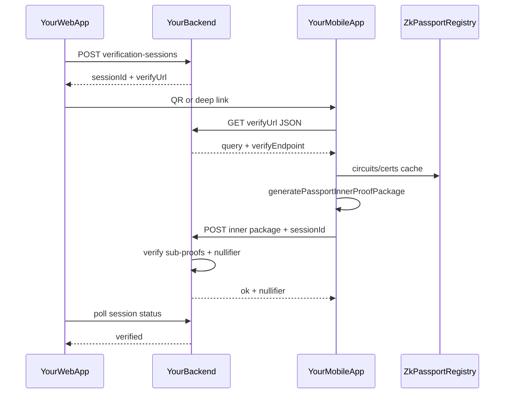

# Product roadmap

Standalone mobile app (derived from [Vocdoni Passport](https://github.com/vocdoni/vocdoni-passport)) + off-chain verification API + web session flow. **Phases are sequential—finish verify criteria before starting the next.**

## How we execute

- **Baby steps.** One route or one mobile change per step; **verify before the next** (`curl` → browser → phone paste → deeplink).
- **Phase 1 = verify API + signing E2E.** Public Vocdoni test petitions are **not** available (see [Phase 1](#phase-1--verification-api-world-republic-nextjs)). **Phase 2** = mobile polish. **Phase 5 web** waits for **Phase 3 iOS + Phase 4 Aadhaar** ([@Self](../self) parity)—see phase table.
- **Verify after each step** ([Karpathy guidelines](../.cursor/rules/karpathy-guidelines.mdc): small diffs, explicit checks).
- **Agent / Cursor:** `@docs/ROADMAP.md` for context; state active sub-step (e.g. “Phase 1.6 only”).
- **Current focus:** Phase 1 Block B — phone paste → signing (see [Immediate next actions](#immediate-next-actions)).
- **Builds / dev setup:** [`README.md`](../README.md#android-release-build-on-google-cloud) (not a roadmap phase).
- **Codebase map:** [Key files](#key-files) (not a roadmap phase).

| Phase | Summary | Status |
|-------|---------|--------|
| 1 | Verify API + multipass signing E2E (baby steps) | in progress |
| 2 | Wallet optional, branding | |
| 3 | iOS inner proving (Barretenberg) | |
| 4 | Aadhaar (Anon Aadhaar Noir + BB) | |
| 5 | Web integration (member-facing; after Self parity) | |
| 6 | Security hardening (before beta) | |
| 7 | Global e-IDs ([anon-citizen-map](https://github.com/anon-aadhaar/anon-citizen-map) catalog) | |

---

## Product goal

Enable **your web app** to offer identity verification where users:

1. Use **your app** on **Android and iOS**.
2. Prove attributes from an **NFC ID stored on device** via **zero-knowledge inner proofs** on the phone.
3. Your backend records **verified + nullifier** for a session—**not** raw passport data.

**v1 (Android-first):** Phases 1–2 for first passport E2E; **Phase 5 web** only after **iOS (Phase 3) + Aadhaar (Phase 4)**—parity with today’s [@Self](../self) coverage (passport + Aadhaar on iOS/Android). Phase 1 dev API is for testing, not member-facing web.

**In scope:** Inner proofs on device → POST `InnerProofPackage` → **your backend verifies sub-proofs + nullifier** → web shows verified. **No blockchain.**

**Out of scope (unless requirements change):** Closed ZKPassport consumer app/SDK, **live Vocdoni petition hosts** (e.g. `nomad.dabax.net`—dev-only, not maintained), mandatory EVM wallet, **on-device outer proof**, **on-chain verifier**. The app skips outer proving on device ([`ProofGenerator.ts`](../src/services/ProofGenerator.ts) ~298); Phase 1 replaces Vocdoni **aggregate** with **off-chain inner verify** (no outer proof, no chain). **Test elections** use our session URLs, not upstream petitions.

**Protocol deps (passport / NFC):** `@zkpassport/utils`, `@zkpassport/registry`, `@zkpassport/poseidon2`. **Build dep:** [vocdoni-passport-prover](https://github.com/vocdoni/vocdoni-passport-prover) for ACVM JNI in Docker (`make apk`)—not their aggregation server.

**Aadhaar (Phase 4, before web):** separate document lane—mAadhaar **QR** (not NFC), Noir circuits from [anon-aadhaar-noir](https://github.com/anon-aadhaar/anon-aadhaar-noir), reuse on-device **ACVM + Barretenberg** like zkPassport. Circom only if Noir path fails (see [Phase 4](#phase-4--aadhaar-anon-aadhaar-noir)).

**Global e-IDs (later, Phase 7):** use [anon-citizen-map](https://github.com/anon-aadhaar/anon-citizen-map) (`national-id.json`) as the country/system backlog—integrate **each** listed electronic ID where a ZK path exists or can be built (zkPassport NFC, Anon Aadhaar–style, or new circuits). Aspirational, catalog-driven; not one release (see [Phase 7](#phase-7--global-e-ids-anon-citizen-map)).

### Registry vs verification (blockchain)

Two different uses of “chain” show up in this project—do not conflate them.

| Use | Role in v1 |
|-----|------------|
| **zkPassport registry** | **Read-only.** [`ProofGenerator.ts`](../src/services/ProofGenerator.ts) uses `RegistryClient` (`CHAIN_ID`, e.g. Sepolia or mainnet) to download circuit manifests and CSCA/certificates (on-chain registry metadata + CDN/IPFS). Required for passport NFC proving. **Not** your verification product. |
| **World Republic verification** | **Off-chain.** Session + nullifier on **your API** after inner-proof verify. No publishing user proofs to Ethereum, no on-chain verifier contract for v1. |

**“No blockchain” in this roadmap** refers to the **verification path** above (product goal, Phase 1–5): you do not record “verified” or nullifiers on-chain, and the app skips outer proving on device. It does **not** mean removing `@zkpassport/registry` or `CHAIN_ID`—those stay as protocol infrastructure.

**What the phone posts:** `InnerProofPackage` to your `aggregateUrl` / `submitUrl` (dev API in Phase 1, production verify routes later)—**not** to a chain. **What the phone does not post:** outer proofs on-chain ([`ProofGenerator.ts`](../src/services/ProofGenerator.ts) skips outer on device).

Registry download failures (e.g. Sepolia certificate CDN 404) are **read** problems for circuits/certs; multipass uses CDN then **IPFS by CID** ([`fetchPackagedCertificates.ts`](../src/services/fetchPackagedCertificates.ts)). Mainnet `CHAIN_ID` is not a drop-in fix (circuits `0.16.0` are Sepolia-side).

---

## Target architecture



Today: mobile ends at Vocdoni [`aggregateProofOnServer`](../src/services/ServerClient.ts) after [`generatePassportInnerProofPackage`](../src/services/ProofGenerator.ts).

---

## Constraints and decisions

| Topic | Decision |
|--------|----------|
| Package manager | **npm** `--legacy-peer-deps` on **WSL ext4** |
| Repo | **Standalone GitHub repo**—no Vocdoni upstream sync |
| Canonical path | WSL ext4 (e.g. `/home/balazs/world-republic/multipass`) |
| Git remote | [worldrepublicorg/multipass](https://github.com/worldrepublicorg/multipass) |
| Android builds | **`make apk`** (Docker)—not `npm run android` / AVD |
| APK build host | **Google Cloud Compute Engine (≥16 GB RAM)**—see [APK builds (GCP)](#apk-builds-google-cloud). Use existing GCP project (e.g. verification). Local `make apk` only on **≥16 GB** RAM; **12 GB dev laptop uses cloud** (Docker Barretenberg build OOMs WSL). |
| Device testing | **Physical Android**, sideload APK (no USB) |
| CI | Optional: **GCE VM** runner (see [Optional CI](#optional-ci-for-android-builds)) |
| Verify API | **world-republic** Next.js routes under `app/api/dev/multipass/` (see [Phase 1](#phase-1--verification-api-world-republic-nextjs)); production paths TBD |
| Prover / verify logic | Off-chain **inner** verify only—port from [vocdoni-passport-prover](https://github.com/vocdoni/vocdoni-passport-prover) in Phase 1 Block C; no outer-proof server required for v1 |
| Verification on-chain | **Not used** for v1 — nullifier + verified state on your API only |
| zkPassport registry | **Read-only** — `CHAIN_ID` + `@zkpassport/registry` for circuits/certs; see [Registry vs verification](#registry-vs-verification-blockchain) |
| Wallet | Optional / removed for v1 |
| Security | Private dev OK; **Phase 6** before public beta |
| Web vs Self | Member-facing **world-republic** verification UI (**Phase 5**) only after **iOS + Aadhaar** in multipass—do not replace [@Self](../self) until coverage matches |
| Aadhaar ZK | **Primary:** [anon-aadhaar-noir](https://github.com/anon-aadhaar/anon-aadhaar-noir) + existing BB/ACVM JNI. **Fallback:** upstream Circom ([anon-aadhaar](https://github.com/anon-aadhaar/anon-aadhaar)) or Self’s Circom fork—only if Noir integration blocked |
| Aadhaar input | mAadhaar QR upload (not zkPassport NFC) |
| Global e-ID backlog | [anon-citizen-map](https://github.com/anon-aadhaar/anon-citizen-map) `public/national-id.json`; live map at [anon-citizen-map.vercel.app](https://anon-citizen-map.vercel.app) |

---

## Dev environment (canonical)

Split: **local WSL** for day-to-day dev; **Google Cloud VM** for release APK builds.

### Local — WSL2 Ubuntu (ext4)

| Need | Setup |
|------|--------|
| Code + `node_modules` | WSL path (ext4) |
| Node | 18+; `npm install --legacy-peer-deps` |
| Tests | `npm test`, `npm run typecheck` |
| Phone | Sideload `out/app-release.apk` after download from build host (unknown sources) |

**Do not run `make apk` on the 12 GB dev laptop** (WSL/Docker OOM; host may require full restart). Cap WSL if needed: `memory=4GB` in `%UserProfile%\.wslconfig`, then `wsl --shutdown`.

```bash
cd /home/balazs/world-republic/multipass   # example
npm install --legacy-peer-deps
npm test
npm run typecheck
```

### APK builds (Google Cloud)

Use a **16 GB** GCE VM (`e2-standard-4`, Ubuntu 22.04, ≥100 GB disk). Full checklist (private repo tarball, Docker **buildx**, BuildKit, troubleshooting): **[README → Android release build on Google Cloud](../README.md#android-release-build-on-google-cloud)**.

---

## Optional: CI for Android builds

When repeat `make apk` runs are painful, automate on a cloud VM:

| Option | Notes |
|--------|--------|
| **GCE VM runner** | Same VM pattern as [APK builds](#apk-builds-google-cloud); run [`android-build.yml`](../.github/workflows/android-build.yml) manually or register a self-hosted runner **on the VM**, not on the laptop |
| **GitHub-hosted `ubuntu-latest`** | ~7 GB RAM—may OOM on full Docker image; try only as experiment |
| **Laptop self-hosted runner** | Not recommended below **16 GB** host RAM |

Release signing secrets only needed for store-style builds ([`releasing.md`](releasing.md)).

---

## Phase 1 — Verification API (world-republic Next.js)

**Goal:** Multipass completes a **test verification session** via deeplink or pasted URL—POST `InnerProofPackage` to **our** API, receive **nullifier**, no outer proof, no blockchain.

**Where (monorepo):** Parent app [world-republic](https://github.com/worldrepublicorg/world-republic) (sibling of `multipass/`):

| Piece | Path (from repo root) |
|--------|------------------------|
| API routes | `app/api/dev/multipass/` |
| Dev test UI | e.g. `app/[lang]/dev/multipass/page.tsx` (unlisted, **no auth**)—creates session, shows **copy link** for phone testing |
| Session store | Postgres (`multipass_dev_sessions`); 24h TTL |

**Compatibility:** Early steps return Vocdoni-shaped JSON (`aggregateUrl`, `kind: vocdoni-passport-request`, `query`) so multipass changes stay minimal. Rename to `submitUrl` / `verifyUrl` in step 1.15.

**Dev testing:** Scanner **paste** first; **deeplink** at 1.9. No public QR or App Links until [Phase 2](#phase-2--mobile-product-polish). Phone must reach dev host (`NEXTAUTH_URL` / tunnel / deploy URL).

**Not used:** Vocdoni public petitions, `vocdoni.link` production flows, self-hosting full vocdoni-passport-prover aggregation (outer proof) unless a sub-step explicitly needs it.

### Block A — done (world-republic API)

Implemented and verified (`curl` / browser): health, sessions, proof-request JSON, stub aggregate (with request metrics logging), dev test page + session status polling. Sessions persisted in Postgres (`multipass_dev_sessions`).

### Block B — Phone (minimal multipass changes)

One APK rebuild per sub-step. Use **paste** in Scanner first; **deeplink** at 1.9.

| Step | Action | Verify |
|------|--------|--------|
| 1.6 | Paste `verifyUrl` from dev page → **ServerCheck** passes | Health OK |
| 1.7 | Same → through disclosure (no code change if 1.6 OK) | UI through **DisclosureReview** |
| 1.8 | Full flow with 1.4 stub POST (on-device prove + stub upload) | **SigningSuccess** + history row |
| 1.9 | Deeplink: open `verifyUrl` via intent / tap saved link | Same as 1.8 |

Mobile touch points (when needed): [`requestLinks.ts`](../src/utils/requestLinks.ts), [`ServerClient.ts`](../src/services/ServerClient.ts), signing screens—**only** if default hosts still point at Vocdoni; often just use dev `verifyUrl` as-is.

**Optional in Block B (before 1.8 retest):** drop `walletAddress` in [`ProofProgressScreen`](../src/screens/signing/ProofProgressScreen.tsx) so proofs omit `bind_evm`—same change as [Phase 2b](#phase-2--mobile-product-polish).

### Block C — Real verify (still incremental)

| Step | Action | Verify |
|------|--------|--------|
| 1.11 | Verify one inner sub-proof; reject invalid bodies | `curl` bad body → 4xx |
| 1.12 | Full inner verify + session nullifier dedup | Second sign → duplicate rejected |
| 1.13 | Port remaining verify from [vocdoni-passport-prover](https://github.com/vocdoni/vocdoni-passport-prover) | E2E with real crypto |

### Block D — API shape cleanup

| Step | Action | Verify |
|------|--------|--------|
| 1.15 | Rename `aggregateUrl` → `submitUrl` (+ dual-read in multipass) | E2E after rename |

**Phase 1 done when:** 1.8 (stub) and 1.12 (real verify) pass on a physical Android device with a dev session link.

---

## Phase 2 — Mobile product polish

**When:** After Phase 1 Block B (1.8), or in parallel once 1.6 passes. Cosmetic and wallet UX—**not** required for first signing E2E.

| Step | Change | Verify |
|------|--------|--------|
| 2a | Optional wallet ([`App.tsx`](../App.tsx), [`WalletContext`](../src/contexts/WalletContext.tsx)) | Main without mnemonic |
| 2b | No `walletAddress` in signing ([`ProofProgressScreen`](../src/screens/signing/ProofProgressScreen.tsx)) | No `bind_evm`; retest 1.8 on dev API |
| 2c | Branding | Your app name |
| 2d | App Links host for deeplinks (optional) | HTTPS opens signing after 1.9 paste works |

**Verify:** `npm test` + `make apk` + physical device against dev session URL from Phase 1.

---

## Phase 3 — iOS inner proving parity

**When:** After Phase 1 passport E2E on Android (1.12) and Phase 2 polish as needed. Required before [Phase 5](#phase-5--web-app-integration) (Self already ships iOS passport proofs).

**Not in scope:** outer proof / on-chain (see [Future-only](#future-only-outer-proof--on-chain)).

| Piece | Android | iOS today |
|-------|---------|-----------|
| ACVM witness | JNI | ✅ [`AcvmWitness.mm`](../ios/VocdoniPassport/AcvmWitness.mm) |
| Barretenberg | ✅ | ❌ [`ProofGenerator.ts`](../src/services/ProofGenerator.ts) iOS guard |

**Likely ZKPassport iOS approach:** same Noir + ACVM + Barretenberg on device ([noir_rs](https://github.com/zkpassport/noir_rs), [Swoir](https://github.com/Swoir/swoir)); [cloud-prover](https://github.com/zkpassport/cloud-prover) not needed for our product.

**Recommended path:** Port Android **msgpack `bbapi`** → iOS `Barretenberg.mm` + `libbarretenberg.a` (build on **macOS**).

| Step | Work |
|------|------|
| 3.1 | Cross-compile Barretenberg for iOS |
| 3.2 | RN native module matching [`Barretenberg.ts`](../src/native/Barretenberg.ts) |
| 3.3 | CRS on iOS |
| 3.4 | Remove iOS guard; test on iPhone + NFC |
| 3.5 | Mac CI / TestFlight when ready |

**Verify:** Inner proofs on iPhone; Phase 1 off-chain flow works.

---

## Phase 4 — Aadhaar (Anon Aadhaar Noir)

**When:** After passport path + **iOS inner proving (Phase 3)** on Android at minimum; iOS Aadhaar E2E in step 4.5. Run [Phase 6](#phase-6--security-checklist-before-public-or-beta) checklist before shipping Aadhaar to real users.

**Goal:** Indian users prove attributes from **mAadhaar QR** on-device, POST a proof to **your** verify API (same session/nullifier model as Phase 1)—**not** raw QR bytes. No blockchain for v1.

**Primary stack (preferred):** [anon-aadhaar/anon-aadhaar-noir](https://github.com/anon-aadhaar/anon-aadhaar-noir)—Noir implementation of Anon Aadhaar, proved with **Barretenberg** (Ultra Honk). Reuse existing mobile infra: [`AcvmWitness`](../src/native/AcvmWitness.ts) + [`Barretenberg.ts`](../src/native/Barretenberg.ts) / [`ProofGenerator.ts`](../src/services/ProofGenerator.ts) pattern (separate circuit artifacts and API payload from zkPassport `InnerProofPackage`).

**Fallback (only if Noir path is blocked):** Circom + Groth16 from [anon-aadhaar/anon-aadhaar](https://github.com/anon-aadhaar/anon-aadhaar) (`@anon-aadhaar/core`, published zkeys)—or, for integration patterns only, [Self](../self) (`@selfxyz/anon-aadhaar-core`, `register_aadhaar` / `vc_and_disclose_aadhaar` circuits). Do **not** adopt Self TEE proving unless product requirements change.

| Step | Action | Verify |
|------|--------|--------|
| 4.1 | Spike: compile anon-aadhaar-noir circuits; align **Noir/BB** versions with Android JNI build (repo pins Noir **0.38** / BB **0.61**—may differ from zkPassport `0.16.0` registry) | `nargo test` + one proof on desktop BB |
| 4.2 | QR onboarding: mAadhaar QR capture (photo/screenshot); parse with `@anon-aadhaar/core` helpers (see anon-aadhaar-noir `/js` or upstream core) | Parse test vectors; expiry/timestamp checks |
| 4.3 | Mobile prove: witness (ACVM) + `circuitProve` for anon-aadhaar-noir bytecode/vkey; ship CRS/artifacts in app or cache | Proof on physical Android |
| 4.4 | Backend: off-chain verify (BB/Ultra Honk verifier for Noir proofs); session + nullifier; **separate** endpoint or `documentType` from passport verify | E2E via Phase 1 dev session (paste/deeplink)—not member web yet |
| 4.5 | iOS: same BB port as Phase 3, then Aadhaar circuits | iPhone E2E |
| 4.6 | **Gate:** maintainer warning—noir repo is **not** production-safe yet; track audits and [PSE docs](https://documentation.anon-aadhaar.pse.dev/docs/intro) before real Aadhaar data | Written go/no-go |
| 4.7 | **Fallback trigger:** if 4.1/4.3 fail (version lock, circuit gap, perf), switch to Circom path (4.8) | Document decision in repo |
| 4.8 | *(Fallback only)* Circom prove (e.g. snarkjs / Mopro) + Groth16 verify on API; optional reference: Self `circuits/` + `new-common/src/documents/aadhaar/` | E2E on fallback stack |

**Not in scope for Phase 4 unless requirements change:** Self protocol / on-chain `IdentityRegistryAadhaar`, TEE-remote proving, treating Aadhaar as zkPassport NFC.

India is catalog entry **Lane B** in [Phase 7](#phase-7--global-e-ids-anon-citizen-map) ([anon-citizen-map](https://github.com/anon-aadhaar/anon-citizen-map) → `India` / Aadhaar).

### References (Aadhaar)

| Resource | URL / path | Notes |
|----------|------------|--------|
| **Anon Aadhaar Noir (primary)** | https://github.com/anon-aadhaar/anon-aadhaar-noir | Most active org repo; `/circuits`, `/js`, `/scripts`; BB benchmarks ~2.7s prove (M1) |
| Anon Aadhaar Circom (fallback) | https://github.com/anon-aadhaar/anon-aadhaar | Production-oriented Circom; npm `@anon-aadhaar/core`, `@anon-aadhaar/circuits`, `@anon-aadhaar/react` |
| Protocol docs | https://documentation.anon-aadhaar.pse.dev/docs/intro | Features, packages, production guidance |
| UIDAI test QR | https://uidai.gov.in/en/ecosystem/authentication-devices-documents/qr-code-reader.html | Official test data (also referenced in Self mocks) |
| Mopro mobile benchmarks (Noir AA) | https://zkmopro.org/docs/performance/ | Noir anon-aadhaar on Android/iOS reference timings |
| Self (Circom fallback / UX reference only) | `../self` | `app/src/screens/documents/aadhaar/`, `new-common/src/documents/aadhaar/`, `circuits/circuits/register/register_aadhaar.circom`; uses TEE for prove—**not** our default |
| Our passport prover pattern | [`ProofGenerator.ts`](../src/services/ProofGenerator.ts), [`Barretenberg.ts`](../src/native/Barretenberg.ts) | Template for second proof pipeline |
| **Anon citizen map (catalog)** | https://github.com/anon-aadhaar/anon-citizen-map | World map + `national-id.json` per-country `system` / `algorithm`; integration backlog for Phase 7 |
| Citizen map data (raw JSON) | https://raw.githubusercontent.com/anon-aadhaar/anon-citizen-map/main/public/national-id.json | Machine-readable catalog to vendor or sync in-repo |

---

## Phase 5 — Web app integration

**When:** After **Phase 3 (iOS passport)** and **Phase 4 (Aadhaar)**—multipass must match [@Self](../self) platform + document coverage before **world-republic** replaces Self for member verification. Phase 1 dev sessions remain the test harness until then.

Builds on Phase 1 API → **test elections** and member-facing flows (not the dev test page).

| Step | Verify |
|------|--------|
| 5a | Production session API + QR / link opens signing |
| 5b | Poll shows verified (uses 1.14-style status) |
| 5c | App Links / universal links for multipass host |

---

## Future-only: outer proof / on-chain

Only if you later need **on-chain** verification. Not required for Phases 2–5.

| Approach | Off-chain web login? |
|----------|----------------------|
| Inner proofs + your API | **Yes** |
| iOS inner proofs | **Yes** |
| Outer + on-chain | **No** |

---

## Phase 6 — Security checklist (before public or beta)

**When:** Before **Phase 5** member-facing web goes to beta/public (and for any Aadhaar build with real user data).

| Area | Actions |
|------|---------|
| Self-hosted runner | Restrict fork PRs; consider cloud VM; remove when unused |
| Secrets | Minimize on runner; rotate keystores |
| API | TLS, TTL, rate limits, proof validation, no PII in logs |
| Mobile | Release signing; distribution policy |
| App | Deep links, network security |
| AGPL | Source offer if distributing APK |
| Aadhaar (if Phase 4 shipped) | QR handling, separate verifier, maintainer go/no-go; no raw QR in logs |
| Global e-IDs (if Phase 7) | Per-`documentType` verify; catalog-driven expectations; no false “supported” for Lane D |

---

## Phase 7 — Global e-IDs (anon-citizen-map)

**When:** After Phase 4 proves the **non–ICAO** pattern (QR / national signature → Noir + BB → off-chain verify). Passport/NFC countries already overlap zkPassport (Phases 1–3).

**Goal:** Work through the [anon-citizen-map](https://github.com/anon-aadhaar/anon-citizen-map) catalog and **try to integrate every listed electronic ID** where cryptography is known and mobile ZK is feasible—same privacy bar as Phase 1/4 (proof + nullifier on your API, no raw ID payloads in logs).

**Catalog:** [anon-citizen-map.vercel.app](https://anon-citizen-map.vercel.app) — per-country `system`, `algorithm`, population ([`public/national-id.json`](https://github.com/anon-aadhaar/anon-citizen-map/blob/main/public/national-id.json)). Data is community-sourced; expect gaps (“Not publicly specified”) and open [GitHub issues](https://github.com/anon-aadhaar/anon-citizen-map/issues) for corrections.

**Integration lanes (per country):**

| Lane | Examples from catalog | App work |
|------|----------------------|----------|
| **A — zkPassport NFC** | EU eID (Germany CIE, Estonia e-ID, Spain DNIe, …), ICAO ePassport where applicable | Phases 1–3 path; confirm country in registry / NFC UX |
| **B — Anon Aadhaar family** | India (Aadhaar, RSA/SHA-256) | Phase 4 ([anon-aadhaar-noir](https://github.com/anon-aadhaar/anon-aadhaar-noir)) |
| **C — New ZK circuit** | QR/card systems with documented algo (e.g. RSA/ECDSA/SM2 entries) but no upstream Noir/Circom yet | Spike → Noir preferred (BB reuse) or Circom fallback; contribute upstream to anon-aadhaar org when possible |
| **D — Blocked / research** | “Not publicly specified”, QES-only, no citizen-readable credential | Document in backlog; do not ship until spec exists |

| Step | Action | Verify |
|------|--------|--------|
| 7.1 | Import or sync `national-id.json`; generate internal backlog (country → lane A/B/C/D) | Checklist file or issue template with all catalog entries |
| 7.2 | Sort backlog: population, algorithm clarity, overlap with zkPassport registry | Prioritized top-N countries |
| 7.3 | **Lane A:** audit map entries vs `@zkpassport/registry` coverage; fix UX/docs for supported NFC IDs | Matrix: country → supported / unsupported |
| 7.4 | **Lane B:** complete Phase 4 (India) | Aadhaar E2E |
| 7.5 | **Lane C loop** (repeat per country): spec credential format → proof pipeline → `documentType` on verify API → mobile onboarding | One country E2E per iteration |
| 7.6 | Contribute back: PRs/issues on [anon-citizen-map](https://github.com/anon-aadhaar/anon-citizen-map) (data fixes) and anon-aadhaar circuits/SDKs when adding a country | Upstream link in changelog |
| 7.7 | App UX: country/system picker driven by catalog + support status (supported / coming / unavailable) | User sees accurate expectations |

**Scope honesty:** “All” IDs in the map is a **long-running** objective (~40+ countries in JSON today, growing). Ship incrementally; Lane C may require net-new cryptography (SM2, GOST, etc.) beyond current BB/Noir deps.

**Not in scope unless requirements change:** Claiming support for map entries with unknown algorithms; single monolithic circuit for all countries; on-chain registries per country.

### References (global e-ID)

| Resource | URL | Notes |
|----------|-----|--------|
| **Anon citizen map** | https://github.com/anon-aadhaar/anon-citizen-map | Next.js map UI; issue template for corrections |
| Live deployment | https://anon-citizen-map.vercel.app | Interactive world map |
| Catalog JSON | https://github.com/anon-aadhaar/anon-citizen-map/blob/main/public/national-id.json | `system`, `algorithm`, `population` per country |
| zkPassport (Lane A) | https://zkpassport.id | ICAO/eMRTD + many national NFC IDs |
| Anon Aadhaar org | https://github.com/anon-aadhaar | Sibling repos: noir, circom, citizen-map |

---

## Key files

| Concern | Location |
|---------|----------|
| App entry | [`App.tsx`](../App.tsx) |
| Signing flow | [`SigningNavigator`](../src/navigation/SigningNavigator.tsx), [`requestLinks.ts`](../src/utils/requestLinks.ts) |
| Inner proofs (passport) | [`ProofGenerator.ts`](../src/services/ProofGenerator.ts) |
| Verify API (Phase 1) | `world-republic` → `app/api/dev/multipass/` |
| Dev session UI (Phase 1) | `world-republic` → `app/[lang]/dev/multipass/` (unlisted, no auth) |
| Aadhaar (planned) | Phase 4 — [anon-aadhaar-noir](https://github.com/anon-aadhaar/anon-aadhaar-noir) |
| Member web (planned) | Phase 5 — after iOS + Aadhaar; keep [@Self](../self) until then |
| Global e-ID catalog | Phase 7 — [anon-citizen-map](https://github.com/anon-aadhaar/anon-citizen-map) `national-id.json` |
| Server I/O (multipass) | [`ServerClient.ts`](../src/services/ServerClient.ts) |
| APK build | [`Makefile`](../Makefile), [`docker/apk.Dockerfile`](../docker/apk.Dockerfile) |
| CI Android | [`android-build.yml`](../.github/workflows/android-build.yml) |

---

## Immediate next actions

1. **Phase 1.6–1.8** — paste dev `verifyUrl` on phone (GCP APK + IPFS cert fallback) → signing success (stub).
2. **Phase 2b** (optional during 1.8) — drop `walletAddress` / `bind_evm`; retest 1.8.
3. **Phase 1.11–1.12** — real verify + nullifier dedup.
4. **Phase 1.15** — rename `aggregateUrl` → `submitUrl` when convenient.
5. Phase 2a/2c branding when 1.12 is green.
6. **Later:** Phase 3 iOS → Phase 4 Aadhaar → **Phase 5** member web (replace Self for verification).

For Cursor: `@docs/ROADMAP.md` and state active sub-step (e.g. “Phase 1.6 only”).
