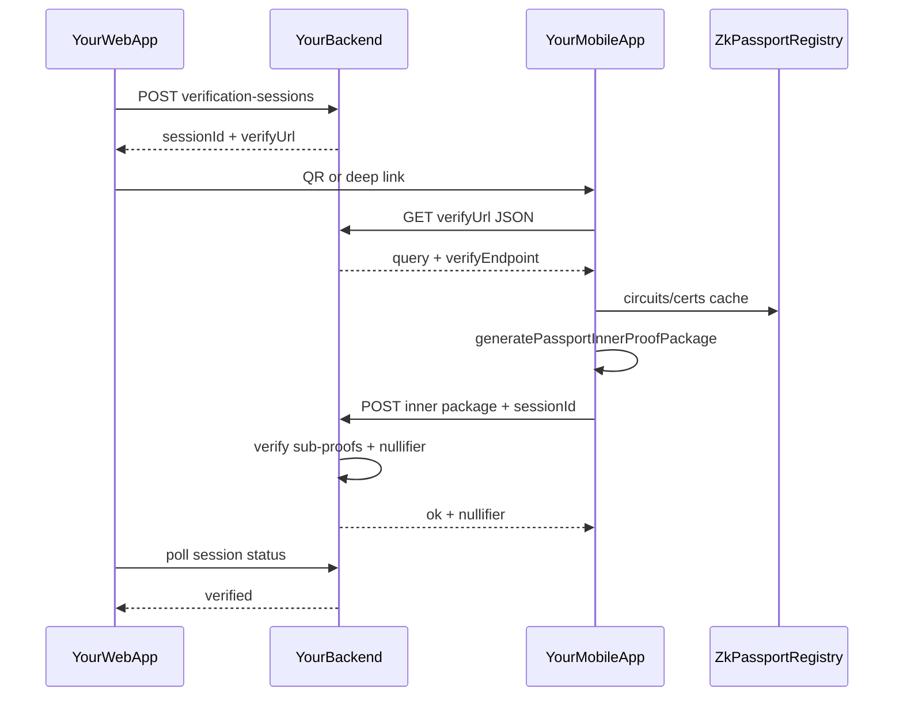

# Product roadmap

Standalone mobile app (derived from [Vocdoni Passport](https://github.com/vocdoni/vocdoni-passport)) + off-chain verification API + web session flow. **Phases are sequential—finish verify criteria before starting the next.**

## How we execute

- **One phase at a time.** Do not implement Phase 3 while still in Phase 0 unless explicitly planned.
- **Verify after each step** ([Karpathy guidelines](../.cursor/rules/karpathy-guidelines.mdc): small diffs, explicit checks).
- **Agent / Cursor:** `@docs/ROADMAP.md` for context; instruct which phase is active (e.g. “Phase 0 only”).
- **Current focus:** Phase 0 (see [Immediate next actions](#immediate-next-actions)).

| Phase | Summary | Status |
|-------|---------|--------|
| 0.0 | Detach repo from Vocdoni fork | |
| 0 | WSL, `make apk`, phone sideload | |
| 0.6 | Self-hosted CI runner (WSL PC) | |
| 1 | Code read-through | |
| 2 | Wallet optional, branding | |
| 3 | Your verify API (inner proofs) | |
| 4 | Web integration | |
| 5 | iOS inner proving (Barretenberg) | |
| 6 | Security hardening (before beta) | |
| 7 | Aadhaar (Anon Aadhaar Noir + BB) | |
| 8 | Global e-IDs ([anon-citizen-map](https://github.com/anon-aadhaar/anon-citizen-map) catalog) | |

---

## Product goal

Enable **your web app** to offer identity verification where users:

1. Use **your app** on **Android and iOS**.
2. Prove attributes from an **NFC ID stored on device** via **zero-knowledge inner proofs** on the phone.
3. Your backend records **verified + nullifier** for a session—**not** raw passport data.

**v1 (Android-first):** Phases 0–4. **iOS inner proving (Phase 5)** is a committed product goal, not optional.

**In scope:** Inner proofs on device → POST `InnerProofPackage` → **your backend verifies sub-proofs + nullifier** → web shows verified. **No blockchain.**

**Out of scope (unless requirements change):** Closed ZKPassport consumer app/SDK, Vocdoni petition infrastructure, mandatory EVM wallet, **on-device outer proof**, **on-chain verifier**. The app skips outer proving on device ([`ProofGenerator.ts`](../src/services/ProofGenerator.ts) ~298); Phase 3 replaces Vocdoni server aggregation with your off-chain verifier.

**Protocol deps (passport / NFC):** `@zkpassport/utils`, `@zkpassport/registry`, `@zkpassport/poseidon2`. **Build dep:** [vocdoni-passport-prover](https://github.com/vocdoni/vocdoni-passport-prover) for ACVM JNI in Docker (`make apk`)—not their aggregation server.

**Aadhaar (later, Phase 7):** separate document lane—mAadhaar **QR** (not NFC), Noir circuits from [anon-aadhaar-noir](https://github.com/anon-aadhaar/anon-aadhaar-noir), reuse on-device **ACVM + Barretenberg** like zkPassport. Circom only if Noir path fails (see [Phase 7](#phase-7--aadhaar-anon-aadhaar-noir)).

**Global e-IDs (later, Phase 8):** use [anon-citizen-map](https://github.com/anon-aadhaar/anon-citizen-map) (`national-id.json`) as the country/system backlog—integrate **each** listed electronic ID where a ZK path exists or can be built (zkPassport NFC, Anon Aadhaar–style, or new circuits). Aspirational, catalog-driven; not one release (see [Phase 8](#phase-8--global-e-ids-anon-citizen-map)).

---

## Target architecture



Today: mobile ends at Vocdoni [`aggregateProofOnServer`](../src/services/ServerClient.ts) after [`generatePassportInnerProofPackage`](../src/services/ProofGenerator.ts).

---

## Constraints and decisions

| Topic | Decision |
|--------|----------|
| Package manager | **npm** `--legacy-peer-deps` on **WSL ext4** |
| Repo | **Standalone GitHub repo**—no Vocdoni upstream sync |
| Canonical path | WSL ext4 (e.g. `/home/balazs/world-republic/multipass`) |
| Android builds | **`make apk`** (Docker)—not `npm run android` / AVD |
| Device testing | **Physical Android**, sideload APK (no USB) |
| CI | Phase 0.6: **self-hosted runner on WSL PC** + [`android-build.yml`](../.github/workflows/android-build.yml) |
| Prover server | **Your off-chain verify API** (inner proofs only) |
| Blockchain | **Not used** for v1 |
| Wallet | Optional / removed for v1 |
| Security | Private dev OK; **Phase 6** before public beta |
| Aadhaar ZK | **Primary:** [anon-aadhaar-noir](https://github.com/anon-aadhaar/anon-aadhaar-noir) + existing BB/ACVM JNI. **Fallback:** upstream Circom ([anon-aadhaar](https://github.com/anon-aadhaar/anon-aadhaar)) or Self’s Circom fork—only if Noir integration blocked |
| Aadhaar input | mAadhaar QR upload (not zkPassport NFC) |
| Global e-ID backlog | [anon-citizen-map](https://github.com/anon-aadhaar/anon-citizen-map) `public/national-id.json`; live map at [anon-citizen-map.vercel.app](https://anon-citizen-map.vercel.app) |

---

## Dev environment (canonical)

**WSL2 Ubuntu (ext4)**

| Need | Setup |
|------|--------|
| Code + `node_modules` | WSL path (ext4) |
| Node | 18+; `npm install --legacy-peer-deps` |
| Docker | Docker in WSL; `docker ps` works |
| Prover for `make apk` | Makefile auto-clone |
| Phone | Sideload `out/app-release.apk` (unknown sources) |

**Not used for primary path:** Windows Gradle, AVD, `\\wsl$\` paths.

```bash
cd /path/to/your-repo
npm install --legacy-peer-deps
make apk
# → out/app-release.apk
```

First `make apk` is slow. Re-run after native or dependency changes.

**Install on phone (no USB):** Copy APK to device → open → install. Optional: wireless `adb install`.

---

## Phase 0.0 — Detach from Vocdoni fork

| Step | Action | Verify |
|------|--------|--------|
| 0.0a | New GitHub repo (public OK for AGPL) | Push target exists |
| 0.0b | `origin` → your repo only; remove `upstream` | `git remote -v` |
| 0.0c | Push; README attribution to Vocdoni @ commit | Your repo, not “forked from” |
| 0.0e | Plan branding/repo metadata in Phase 2 | — |

---

## Phase 0 — Dev environment and baseline app

| Step | Action | Verify |
|------|--------|--------|
| 0.1 | 0.0 + `npm install --legacy-peer-deps` | `npm test`, `npm run typecheck` |
| 0.2 | `make apk` | `out/app-release.apk` |
| 0.3 | Sideload on physical Android | App opens |
| 0.4 | Optional: NFC ID scan | Works on hardware |
| 0.5 | Keep this doc’s dev section accurate | Repeatable |

---

## Phase 0.6 — Self-hosted CI runner (WSL PC)

| Step | Action | Verify |
|------|--------|--------|
| 0.6a | Repo → Actions → Runners → Linux x64; install in WSL | Runner registered |
| 0.6b | Docker available to runner | Runner Idle |
| 0.6c | Run **Android Build** workflow | APK artifact |
| 0.6d | Sideload artifact | Same as 0.3 |

PC must be on when CI runs. Release signing secrets only needed for store-style builds ([`releasing.md`](releasing.md)).

---

## Phase 1 — Understand the codebase

Read: [`App.tsx`](../App.tsx), [`TabNavigator`](../src/navigation/TabNavigator.tsx), [`SigningNavigator`](../src/navigation/SigningNavigator.tsx), [`requestLinks.ts`](../src/utils/requestLinks.ts), [`ServerClient.ts`](../src/services/ServerClient.ts), [`ProofGenerator.ts`](../src/services/ProofGenerator.ts).

**Verify:** Explain Scanner URL → network → server payload today.

---

## Phase 2 — First product changes (mobile)

| Step | Change | Verify |
|------|--------|--------|
| 2a | Optional wallet ([`App.tsx`](../App.tsx), [`WalletContext`](../src/contexts/WalletContext.tsx)) | Main without mnemonic |
| 2b | No `walletAddress` in signing ([`ProofProgressScreen`](../src/screens/signing/ProofProgressScreen.tsx)) | No `bind_evm` |
| 2c | Branding | Your app name |
| 2d | Links / manifest | Your test URL |

**Verify:** `npm test` + `make apk` + physical device.

---

## Phase 3 — Your verification backend

**Goal:** POST `InnerProofPackage` to **your** API—no outer proof.

- `POST /api/verification-sessions` → `{ id, verifyUrl }`
- `GET {verifyUrl}` → request JSON (`verifyUrl` / `submitUrl` instead of `aggregateUrl`)
- `POST /api/verify` → inner package → `{ ok, nullifier }`

Mobile: [`ServerClient.ts`](../src/services/ServerClient.ts), [`ProofProgressScreen`](../src/screens/signing/ProofProgressScreen.tsx), [`ServerCheckScreen`](../src/screens/signing/ServerCheckScreen.tsx).

Server verify logic: port from [vocdoni-passport-prover](https://github.com/vocdoni/vocdoni-passport-prover) verify paths.

**Verify:** E2E on phone; nullifier stored; duplicate rejected.

---

## Phase 4 — Web app integration

| Step | Verify |
|------|--------|
| 4a | QR / link opens signing |
| 4b | Poll shows verified |
| 4c | Optional App Links |

---

## Phase 5 — iOS inner proving parity

**Not in scope:** outer proof / on-chain (see [Future-only](#future-only-outer-proof--on-chain)).

| Piece | Android | iOS today |
|-------|---------|-----------|
| ACVM witness | JNI | ✅ [`AcvmWitness.mm`](../ios/VocdoniPassport/AcvmWitness.mm) |
| Barretenberg | ✅ | ❌ [`ProofGenerator.ts`](../src/services/ProofGenerator.ts) iOS guard |

**Likely ZKPassport iOS approach:** same Noir + ACVM + Barretenberg on device ([noir_rs](https://github.com/zkpassport/noir_rs), [Swoir](https://github.com/Swoir/swoir)); [cloud-prover](https://github.com/zkpassport/cloud-prover) not needed for our product.

**Recommended path:** Port Android **msgpack `bbapi`** → iOS `Barretenberg.mm` + `libbarretenberg.a` (build on **macOS**).

| Step | Work |
|------|------|
| 5.1 | Cross-compile Barretenberg for iOS |
| 5.2 | RN native module matching [`Barretenberg.ts`](../src/native/Barretenberg.ts) |
| 5.3 | CRS on iOS |
| 5.4 | Remove iOS guard; test on iPhone + NFC |
| 5.5 | Mac CI / TestFlight when ready |

**Verify:** Inner proofs on iPhone; Phase 3 off-chain flow works.

---

## Future-only: outer proof / on-chain

Only if you later need **on-chain** verification. Not required for Phases 3–5.

| Approach | Off-chain web login? |
|----------|----------------------|
| Inner proofs + your API | **Yes** |
| iOS inner proofs | **Yes** |
| Outer + on-chain | **No** |

---

## Phase 6 — Security checklist (before public or beta)

| Area | Actions |
|------|---------|
| Self-hosted runner | Restrict fork PRs; consider cloud VM; remove when unused |
| Secrets | Minimize on runner; rotate keystores |
| API | TLS, TTL, rate limits, proof validation, no PII in logs |
| Mobile | Release signing; distribution policy |
| App | Deep links, network security |
| AGPL | Source offer if distributing APK |
| Aadhaar (if Phase 7 shipped) | QR handling, separate verifier, maintainer go/no-go; no raw QR in logs |
| Global e-IDs (if Phase 8) | Per-`documentType` verify; catalog-driven expectations; no false “supported” for Lane D |

---

## Phase 7 — Aadhaar (Anon Aadhaar Noir)

**When:** After the passport path is stable (Phases 3–5). Run Phase 6 checklist for any build that ships Aadhaar.

**Goal:** Indian users prove attributes from **mAadhaar QR** on-device, POST a proof to **your** verify API (same session/nullifier model as Phase 3)—**not** raw QR bytes. No blockchain for v1.

**Primary stack (preferred):** [anon-aadhaar/anon-aadhaar-noir](https://github.com/anon-aadhaar/anon-aadhaar-noir)—Noir implementation of Anon Aadhaar, proved with **Barretenberg** (Ultra Honk). Reuse existing mobile infra: [`AcvmWitness`](../src/native/AcvmWitness.ts) + [`Barretenberg.ts`](../src/native/Barretenberg.ts) / [`ProofGenerator.ts`](../src/services/ProofGenerator.ts) pattern (separate circuit artifacts and API payload from zkPassport `InnerProofPackage`).

**Fallback (only if Noir path is blocked):** Circom + Groth16 from [anon-aadhaar/anon-aadhaar](https://github.com/anon-aadhaar/anon-aadhaar) (`@anon-aadhaar/core`, published zkeys)—or, for integration patterns only, [Self](../self) (`@selfxyz/anon-aadhaar-core`, `register_aadhaar` / `vc_and_disclose_aadhaar` circuits). Do **not** adopt Self TEE proving unless product requirements change.

| Step | Action | Verify |
|------|--------|--------|
| 7.1 | Spike: compile anon-aadhaar-noir circuits; align **Noir/BB** versions with Android JNI build (repo pins Noir **0.38** / BB **0.61**—may differ from zkPassport `0.16.0` registry) | `nargo test` + one proof on desktop BB |
| 7.2 | QR onboarding: mAadhaar QR capture (photo/screenshot); parse with `@anon-aadhaar/core` helpers (see anon-aadhaar-noir `/js` or upstream core) | Parse test vectors; expiry/timestamp checks |
| 7.3 | Mobile prove: witness (ACVM) + `circuitProve` for anon-aadhaar-noir bytecode/vkey; ship CRS/artifacts in app or cache | Proof on physical Android |
| 7.4 | Backend: off-chain verify (BB/Ultra Honk verifier for Noir proofs); session + nullifier; **separate** endpoint or `documentType` from passport verify | E2E with Phase 4-style web poll |
| 7.5 | iOS: same BB port as Phase 5, then Aadhaar circuits | iPhone E2E |
| 7.6 | **Gate:** maintainer warning—noir repo is **not** production-safe yet; track audits and [PSE docs](https://documentation.anon-aadhaar.pse.dev/docs/intro) before real Aadhaar data | Written go/no-go |
| 7.7 | **Fallback trigger:** if 7.1/7.3 fail (version lock, circuit gap, perf), switch to Circom path (7.8) | Document decision in repo |
| 7.8 | *(Fallback only)* Circom prove (e.g. snarkjs / Mopro) + Groth16 verify on API; optional reference: Self `circuits/` + `new-common/src/documents/aadhaar/` | E2E on fallback stack |

**Not in scope for Phase 7 unless requirements change:** Self protocol / on-chain `IdentityRegistryAadhaar`, TEE-remote proving, treating Aadhaar as zkPassport NFC.

India is catalog entry **Lane B** in [Phase 8](#phase-8--global-e-ids-anon-citizen-map) ([anon-citizen-map](https://github.com/anon-aadhaar/anon-citizen-map) → `India` / Aadhaar).

### References (Aadhaar)

| Resource | URL / path | Notes |
|----------|------------|--------|
| **Anon Aadhaar Noir (primary)** | https://github.com/anon-aadhaar/anon-aadhaar-noir | Most active org repo; `/circuits`, `/js`, `/scripts`; BB benchmarks ~2.7s prove (M1) |
| Anon Aadhaar Circom (fallback) | https://github.com/anon-aadhaar/anon-aadhaar | Production-oriented Circom; npm `@anon-aadhaar/core`, `@anon-aadhaar/circuits`, `@anon-aadhaar/react` |
| Protocol docs | https://documentation.anon-aadhaar.pse.dev/docs/intro | Features, packages, production guidance |
| UIDAI test QR | https://uidai.gov.in/en/ecosystem/authentication-devices-documents/qr-code-reader.html | Official test data (also referenced in Self mocks) |
| Mopro mobile benchmarks (Noir AA) | https://zkmopro.org/docs/performance/ | Noir anon-aadhaar on Android/iOS reference timings |
| Self (Circom fallback / UX reference only) | `../self` | `app/src/screens/documents/aadhaar/`, `new-common/src/documents/aadhaar/`, `circuits/circuits/register/register_aadhaar.circom`; uses TEE for prove—**not** our default |
| Our passport prover pattern | [`ProofGenerator.ts`](../src/services/ProofGenerator.ts), [`Barretenberg.ts`](../src/native/Barretenberg.ts) | Template for second proof pipeline |
| **Anon citizen map (catalog)** | https://github.com/anon-aadhaar/anon-citizen-map | World map + `national-id.json` per-country `system` / `algorithm`; integration backlog for Phase 8 |
| Citizen map data (raw JSON) | https://raw.githubusercontent.com/anon-aadhaar/anon-citizen-map/main/public/national-id.json | Machine-readable catalog to vendor or sync in-repo |

---

## Phase 8 — Global e-IDs (anon-citizen-map)

**When:** After Phase 7 proves the **non–ICAO** pattern (QR / national signature → Noir + BB → off-chain verify). Passport/NFC countries already overlap zkPassport (Phases 0–5).

**Goal:** Work through the [anon-citizen-map](https://github.com/anon-aadhaar/anon-citizen-map) catalog and **try to integrate every listed electronic ID** where cryptography is known and mobile ZK is feasible—same privacy bar as Phase 3/7 (proof + nullifier on your API, no raw ID payloads in logs).

**Catalog:** [anon-citizen-map.vercel.app](https://anon-citizen-map.vercel.app) — per-country `system`, `algorithm`, population ([`public/national-id.json`](https://github.com/anon-aadhaar/anon-citizen-map/blob/main/public/national-id.json)). Data is community-sourced; expect gaps (“Not publicly specified”) and open [GitHub issues](https://github.com/anon-aadhaar/anon-citizen-map/issues) for corrections.

**Integration lanes (per country):**

| Lane | Examples from catalog | App work |
|------|----------------------|----------|
| **A — zkPassport NFC** | EU eID (Germany CIE, Estonia e-ID, Spain DNIe, …), ICAO ePassport where applicable | Already Phase 0–5; confirm country in registry / NFC UX |
| **B — Anon Aadhaar family** | India (Aadhaar, RSA/SHA-256) | Phase 7 ([anon-aadhaar-noir](https://github.com/anon-aadhaar/anon-aadhaar-noir)) |
| **C — New ZK circuit** | QR/card systems with documented algo (e.g. RSA/ECDSA/SM2 entries) but no upstream Noir/Circom yet | Spike → Noir preferred (BB reuse) or Circom fallback; contribute upstream to anon-aadhaar org when possible |
| **D — Blocked / research** | “Not publicly specified”, QES-only, no citizen-readable credential | Document in backlog; do not ship until spec exists |

| Step | Action | Verify |
|------|--------|--------|
| 8.1 | Import or sync `national-id.json`; generate internal backlog (country → lane A/B/C/D) | Checklist file or issue template with all catalog entries |
| 8.2 | Sort backlog: population, algorithm clarity, overlap with zkPassport registry | Prioritized top-N countries |
| 8.3 | **Lane A:** audit map entries vs `@zkpassport/registry` coverage; fix UX/docs for supported NFC IDs | Matrix: country → supported / unsupported |
| 8.4 | **Lane B:** complete Phase 7 (India) | Aadhaar E2E |
| 8.5 | **Lane C loop** (repeat per country): spec credential format → proof pipeline → `documentType` on verify API → mobile onboarding | One country E2E per iteration |
| 8.6 | Contribute back: PRs/issues on [anon-citizen-map](https://github.com/anon-aadhaar/anon-citizen-map) (data fixes) and anon-aadhaar circuits/SDKs when adding a country | Upstream link in changelog |
| 8.7 | App UX: country/system picker driven by catalog + support status (supported / coming / unavailable) | User sees accurate expectations |

**Scope honesty:** “All” IDs in the map is a **long-running** objective (~40+ countries in JSON today, growing). Ship incrementally; Lane C may require net-new cryptography (SM2, GOST, etc.) beyond current BB/Noir deps.

**Not in scope unless requirements change:** Claiming support for map entries with unknown algorithms; single monolithic circuit for all countries; on-chain registries per country.

### References (global e-ID)

| Resource | URL | Notes |
|----------|-----|--------|
| **Anon citizen map** | https://github.com/anon-aadhaar/anon-citizen-map | Next.js map UI; issue template for corrections |
| Live deployment | https://anon-citizen-map.vercel.app | Interactive world map |
| Catalog JSON | https://github.com/anon-aadhaar/anon-citizen-map/blob/main/public/national-id.json | `system`, `algorithm`, `population` per country |
| zkPassport (Lane A) | https://zkpassport.id | ICAO/eMRTD + many national NFC IDs |
| Anon Aadhaar org | https://github.com/anon-aadhaar | Sibling repos: noir, circom, citizen-map |

---

## Key files

| Concern | Location |
|---------|----------|
| App entry | [`App.tsx`](../App.tsx) |
| Inner proofs (passport) | [`ProofGenerator.ts`](../src/services/ProofGenerator.ts) |
| Aadhaar (planned) | Phase 7 — [anon-aadhaar-noir](https://github.com/anon-aadhaar/anon-aadhaar-noir) |
| Global e-ID catalog | Phase 8 — [anon-citizen-map](https://github.com/anon-aadhaar/anon-citizen-map) `national-id.json` |
| Server I/O | [`ServerClient.ts`](../src/services/ServerClient.ts) |
| APK build | [`Makefile`](../Makefile), [`docker/apk.Dockerfile`](../docker/apk.Dockerfile) |
| CI Android | [`android-build.yml`](../.github/workflows/android-build.yml) |

---

## Immediate next actions

1. Phase 0.0 — your GitHub repo, remotes, drop Windows duplicate.
2. Phase 0.1–0.3 — `npm install` → `make apk` → sideload.
3. Phase 0.6 — self-hosted runner (when ready).
4. Phase 1 — read-through.
5. Phase 2a — optional wallet.

For Cursor: use [`.cursor/plans/phase-0-dev-baseline.plan.md`](../.cursor/plans/phase-0-dev-baseline.plan.md) as the **active** plan (Phase 0 todos only).
