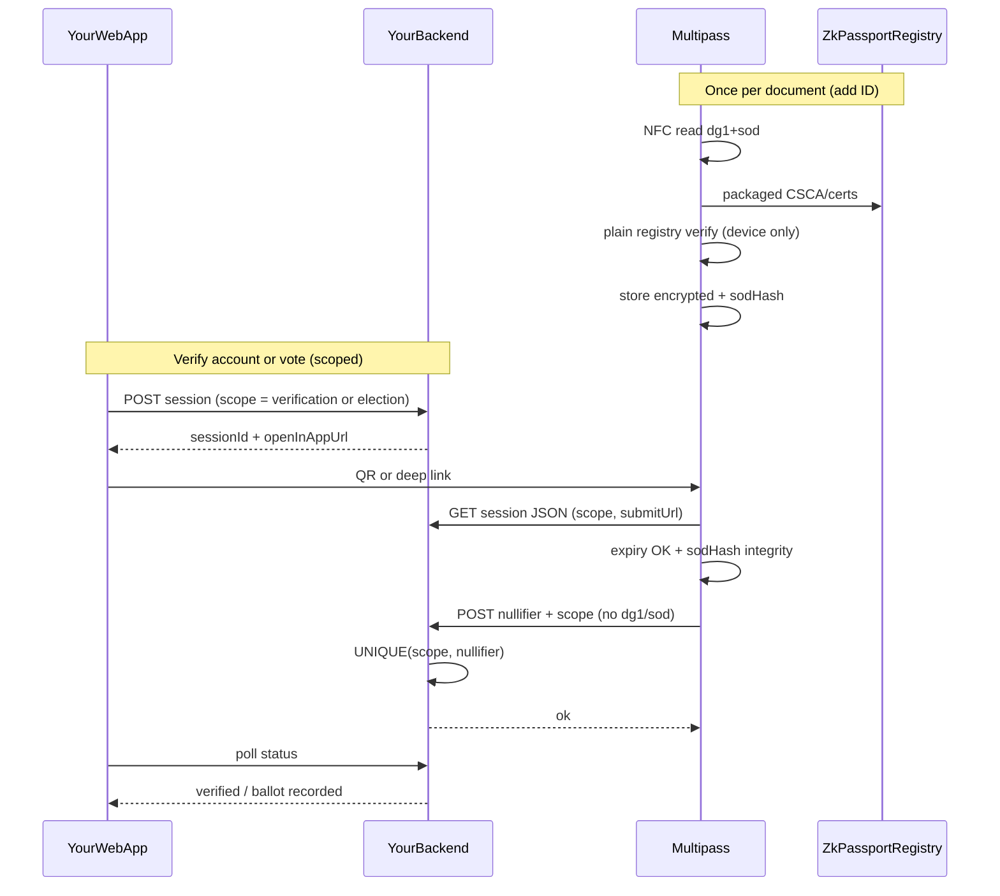
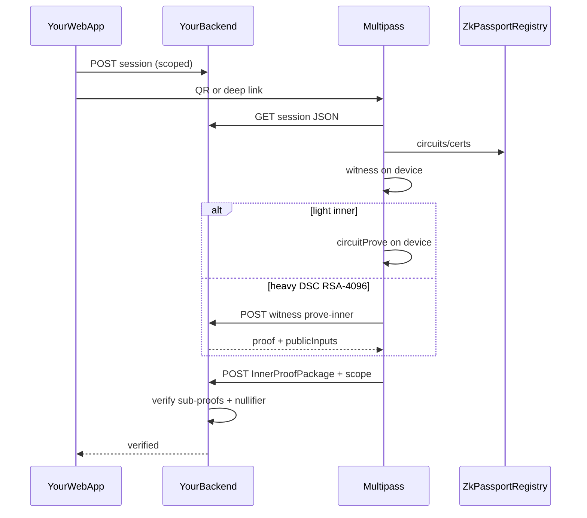

# Product roadmap

Standalone mobile app (derived from [Vocdoni Passport](https://github.com/vocdoni/vocdoni-passport)) + off-chain verification API + web session flow. **Phases are sequential—finish verify criteria before starting the next.**

## How we execute

- **Baby steps.** One route or one mobile change per step; **verify before the next** (`curl` → browser → phone paste → deeplink).
- **Phase 1 = scoped validity credential (Self-parity intent).** Same mobile + API flow for **account verification** and **voting**—only the **scope** differs (session vs election). Public Vocdoni test petitions are **not** available (see [Phase 1](#phase-1--verification-api-world-republic-nextjs)). **Phase 2** = mobile polish. **Phase 5 web** waits for **Phase 3 iOS + Phase 4 Aadhaar** before replacing [@Self](../self)—see phase table.
- **Verify after each step** ([Karpathy guidelines](../.cursor/rules/karpathy-guidelines.mdc): small diffs, explicit checks).
- **Agent / Cursor:** `@docs/ROADMAP.md` for context; state active sub-step (e.g. “Phase 1 E2 only”).
- **Current focus:** Phase 1 **Block E** (trusted path: plain verify at scan + scoped nullifier); **Block B2/C** remain the **ZK lane** toward Self replacement (see [Trust evolution](#trust-evolution-a--d--c) and [Immediate next actions](#immediate-next-actions)).
- **Builds / dev setup:** [`README.md`](../README.md#android-release-build-on-google-cloud) (not a roadmap phase).
- **Codebase map:** [Key files](#key-files) (not a roadmap phase).

| Phase | Summary | Status |
|-------|---------|--------|
| 1 | Scoped validity API + mobile (trusted path **E**; ZK lane **B2/C**) | in progress (pivot to **E**; B2 largely implemented) |
| 2 | Wallet optional, branding | |
| 3 | iOS (NFC + validity; ZK/tiered prove when on **C** path) | |
| 4 | Aadhaar (same scope/nullifier model; material from QR) | |
| 5 | Member web (replace Self only after Phase 3 + 4) | |
| 6 | Security hardening + **platform attestation (D)** before public elections | |
| 7 | Global e-IDs ([anon-citizen-map](https://github.com/anon-aadhaar/anon-citizen-map) catalog) | |

---

## Product goal

World Republic today uses [@Self](../self) for **account verification** and **voting**, checking **document validity** (and expiry)—not rich attribute disclosure. Multipass should offer the **same product** with **one process** and **different scopes**:

| Scope | Example | Server stores |
|-------|---------|----------------|
| **Verification** | `verification:{sessionId}` | `verified` + **nullifier** for that session |
| **Election** | `election:{electionId}` | `cast` + **nullifier**; `UNIQUE(election_id, nullifier)` → one government document → one ballot |

Users:

1. **Scan** an NFC passport (later: Aadhaar QR, iOS) in Multipass.
2. **On device:** plain registry verify at scan (see [Plain registry verify](#plain-registry-verify-at-scan)); encrypted storage of chip blobs—**never upload `dg1`/`sod` to the server** on the production path.
3. **On web action** (verify account or vote): app checks **not expired** + **integrity** (`sodHash` vs scan-time), derives **nullifier** from chip/document material + scope, POSTs to your API.

**Replace Self** for member-facing flows only after **Phase 3 (iOS) + Phase 4 (Aadhaar)**. Until then, Self stays production; Multipass is the Android passport pilot.

**Sybil rule:** one physical document → one nullifier per scope; same person may vote in different elections (different scoped nullifiers).

**No blockchain** for verification/voting v1: nullifier + verified state on **your API** only ([Registry vs verification](#registry-vs-verification-blockchain)).

**Out of scope (unless requirements change):** Closed ZKPassport consumer app/SDK, **live Vocdoni petition hosts**, mandatory EVM wallet, **on-device outer proof**, **on-chain verifier**, rich disclosure queries (`bind_evm`, nationality gates) for validity-only flows. **Ephemeral server verify** (POST `dg1`/`sod`, discard)—**not** the default; conflicts with “never see your document” unless legal/product explicitly accepts transient processing ([Trust evolution](#trust-evolution-a--d--c)).

**Protocol deps (passport / NFC):** `@zkpassport/utils`, `@zkpassport/registry`, `@zkpassport/poseidon2`. **Build dep:** [vocdoni-passport-prover](https://github.com/vocdoni/vocdoni-passport-prover) for ACVM JNI in Docker (`make apk`). **Server dep (same repo / patterns):** inner `CircuitProve` + verify logic on desktop/server BB—not Vocdoni public aggregation unless interoperability requires it.

**Aadhaar (Phase 4, before web):** separate document lane—mAadhaar **QR** (not NFC), Noir circuits from [anon-aadhaar-noir](https://github.com/anon-aadhaar/anon-aadhaar-noir), same **tiered** pattern as passport (ACVM witness on device; prove on device or server). Circom only if Noir path fails (see [Phase 4](#phase-4--aadhaar-anon-aadhaar-noir)).

**Global e-IDs (later, Phase 7):** use [anon-citizen-map](https://github.com/anon-aadhaar/anon-citizen-map) (`national-id.json`) as the country/system backlog—integrate **each** listed electronic ID where a ZK path exists or can be built (zkPassport NFC, Anon Aadhaar–style, or new circuits). Aspirational, catalog-driven; not one release (see [Phase 7](#phase-7--global-e-ids-anon-citizen-map)).

### Registry vs verification (blockchain)

Two different uses of “chain” show up in this project—do not conflate them.

| Use | Role in v1 |
|-----|------------|
| **zkPassport registry** | **Read-only.** `RegistryClient` + packaged CSCA/certs (CDN/IPFS). Used for **plain verify at scan** (path A) and circuit artifacts (path C). **Not** your verification product. |
| **World Republic verification** | **Off-chain.** Scoped session + nullifier on **your API** (path A: trusted app; path C: after inner-proof verify). No on-chain verifier for v1. |

**“No blockchain” in this roadmap** refers to the **verification path** above (product goal, Phase 1–5): you do not record “verified” or nullifiers on-chain, and the app skips outer proving on device. It does **not** mean removing `@zkpassport/registry` or `CHAIN_ID`—those stay as protocol infrastructure.

**What the phone posts (path A, production v1):** scoped **nullifier** + session binding—**not** `dg1`, **not** `sod`, **not** raw MRZ. **What the phone posts (path C, Self replacement):** `InnerProofPackage` (or trimmed validity package) to `submitUrl`; server verifies proofs + nullifier—still **not** raw ID blobs.

Registry download failures (e.g. Sepolia certificate CDN 404) are **read** problems for circuits/certs; multipass uses CDN then **IPFS by CID** ([`fetchPackagedCertificates.ts`](../src/services/fetchPackagedCertificates.ts)). Mainnet `CHAIN_ID` is not a drop-in fix (circuits `0.16.0` are Sepolia-side).

### Trust evolution (A → D → C)

| Stage | Model | When | Server learns passport bytes? |
|-------|--------|------|-------------------------------|
| **A — Trusted app** | Plain verify at scan on device; scoped nullifier + expiry/integrity at submit | **Now** (Phase 1 Block E) | **No** |
| **D — Attestation** | **A** + Play Integrity (Android) / App Attest (iOS) on submit | Before **public elections** / production verify | **No** |
| **C — ZK (Self parity)** | Validity credential via inner proofs + server verify; tiered **prove-inner** for RSA-4096 DSC until mobile BB can run it | **Self replacement** (after iOS + Aadhaar) | **No** (witness may transit for prove-inner only—TLS, ephemeral, no logs) |

**Not on the default ladder:** **B — Ephemeral server plain verify** (check `dg1`/`sod` on server, do not store). Stronger validity than trusting the app, but the server **processes** full ID data—only use if legal/product explicitly allows transient processing.

Plain verify at scan does **not** remove **prove-inner** on path **C**: the server still cannot trust “valid” without a proof unless it sees ID bytes (B) or trusts the app (A).

### Plain registry verify at scan

**Not implemented at add-ID today**—validity is deferred to ZK prove time in [`ProofGenerator.ts`](../src/services/ProofGenerator.ts). Target behavior after NFC:

1. Parse `dg1` + `sod`; load packaged certs from `@zkpassport/registry` (CDN → IPFS fallback).
2. `getCscaForPassportAsync` + `verifyDscSignature` / SOD CMS verify + DG1 hash vs SOD eContent ([`@zkpassport/utils`](https://www.npmjs.com/package/@zkpassport/utils)—`verifyDscSignature`, `verifyRSASignature`, etc.).
3. On success: store encrypted blobs + metadata (`verifiedAt`, `certRoot`, `sodHash`); on failure: do not treat ID as usable.
4. **Re-verify policy:** full plain verify **once at scan**; at verify/vote time only **expiry** (MRZ) + **integrity** (`sodHash` match)—no full DSC re-prove on each cast unless policy changes.

### Proving architecture (tiered) — ZK lane (path C)

Physical Android testing (2025) showed a reliable path for EU passports with **RSA-4096 DSC** circuits:

| Step | Where | Notes |
|------|--------|--------|
| Registry / certs / circuit artifacts | Phone (cache) | Unchanged; read-only `@zkpassport/registry` |
| ACVM **witness** | Phone | Works for heavy circuits (e.g. `sig_check_dsc_tbs_700_rsa_pkcs_4096_sha256`); 32 MB witness thread stack on Android |
| Barretenberg **inner prove** | **Phone or server** | **Heavy inners** (large decompressed ACIR, e.g. ~16 MB for RSA-4096 DSC) fail in mobile `bbapi` (`Length is too large` in ~30 ms)—not CRS sizing and not “buy a faster phone” |
| Outer aggregation | **Server** (optional) | Already skipped on device; v1 needs **inner verify only** |
| Session / nullifier | Your API | Off-chain |

**Policy (path C only):** run `circuitProve` on the phone only for circuits below a size threshold; otherwise `POST` witness + circuit reference to **your** `prove-inner` endpoint (server Barretenberg). Default **server** for `rsa_pkcs_4096` DSC. **Not required** for path **A** production flows.

**Privacy:** server prove receives **witness bytes** (sensitive—not `dg1`/`sod`, but derived from them). Path C: TLS, ephemeral jobs, no witness logging in prod. Stronger guarantees later (TEE, [zkpassport/cloud-prover](https://github.com/zkpassport/cloud-prover)) if required.

**CRS on phone:** size `bn254_g1.dat` from **inner** circuit manifest sizes only—exclude `outer_evm_count_*` to avoid ~256 MB downloads/OOM at Preparing ([`ProofGenerator.ts`](../src/services/ProofGenerator.ts) ~211).

---

## Target architecture

### Path A (production v1) — trusted app + scoped nullifier



Later (**D**): add Play Integrity / App Attest token on the POST step.

### Path C (Self replacement) — ZK validity credential



**Code today:** path **C** partially built ([`ProofGenerator.ts`](../src/services/ProofGenerator.ts), prove-inner route, tiering); path **A** not yet wired at [`addID`](../src/hooks/useIDs.ts). **Next product priority:** Block **E** (path A); keep B2/C for dev and Self parity.

---

## Constraints and decisions

| Topic | Decision |
|--------|----------|
| Package manager | **npm** `--legacy-peer-deps` on **WSL ext4** |
| Repo | **Standalone GitHub repo**—no Vocdoni upstream sync |
| Canonical path | WSL ext4 (e.g. `/home/balazs/world-republic/multipass`) |
| Git remote | [worldrepublicorg/multipass](https://github.com/worldrepublicorg/multipass) |
| Android builds | **`make apk`** (Docker)—not `npm run android` / AVD |
| APK build host | **Google Cloud Compute Engine (≥16 GB RAM)**—see [APK builds (GCP)](#apk-builds-google-cloud). Use existing GCP project (e.g. verification). Local `make apk` only on **≥16 GB** RAM; **12 GB dev laptop uses cloud** (Docker Barretenberg build OOMs WSL). |
| Device testing | **Physical Android**, sideload APK; debug with in-app logs (5× tap on proof screen) or **wireless ADB** — see [README → Debugging on device](../README.md#debugging-on-device-wireless-adb) |
| CI | Optional: **GCE VM** runner (see [Optional CI](#optional-ci-for-android-builds)) |
| Verify API | **world-republic** Next.js routes under `app/api/dev/multipass/` (see [Phase 1](#phase-1--verification-api-world-republic-nextjs)); production paths TBD; **scoped** `verification:*` / `election:*` |
| Production trust (v1) | **Path A:** trusted Multipass + plain verify at scan + scoped nullifier; **no** `dg1`/`sod` on server |
| Attestation | **Path D:** Play Integrity / App Attest before public elections—not optional “later nice-to-have” |
| Self replacement | **Path C:** ZK + inner verify; requires **iOS + Aadhaar** before Phase 5 replaces [@Self](../self) |
| Proving (path C only) | **Tiered:** witness on device; **server `prove-inner`** for heavy inners (RSA-4096 DSC) |
| Prover / verify logic | Path C: off-chain inner verify—port from [vocdoni-passport-prover](https://github.com/vocdoni/vocdoni-passport-prover) (Block C). Path A: nullifier dedup + session binding only |
| Verification on-chain | **Not used** for v1 — nullifier + verified state on your API only |
| zkPassport registry | **Read-only** — certs for **plain verify at scan** and for **ZK circuits** on path C; see [Registry vs verification](#registry-vs-verification-blockchain) |
| Wallet | Optional / removed for v1 |
| Security | Private dev OK; **Phase 6** (+ **D**) before public beta / real elections |
| Web vs Self | Keep **Self** in production until Multipass **iOS + Aadhaar**; same validity-only semantics |
| ID on server | **Do not** store or log `dg1`/`sod`; ephemeral server verify (path B) **not** default |
| Aadhaar ZK | **Primary:** [anon-aadhaar-noir](https://github.com/anon-aadhaar/anon-aadhaar-noir) + existing BB/ACVM JNI. **Fallback:** upstream Circom ([anon-aadhaar](https://github.com/anon-aadhaar/anon-aadhaar)) or Self’s Circom fork—only if Noir integration blocked |
| Aadhaar input | mAadhaar QR upload (not zkPassport NFC) |
| Global e-ID backlog | [anon-citizen-map](https://github.com/anon-aadhaar/anon-citizen-map) `public/national-id.json`; live map at [anon-citizen-map.vercel.app](https://anon-citizen-map.vercel.app) |

---

## Dev environment (canonical)

Split: **local WSL** for day-to-day dev; **Google Cloud VM** for release APK builds.

### Local — WSL2 Ubuntu (ext4)

| Need | Setup |
|------|--------|
| Code + `node_modules` | WSL path (ext4) |
| Node | 18+; `npm install --legacy-peer-deps` |
| Tests | `npm test`, `npm run typecheck` |
| Phone | Sideload `out/app-release.apk` after download from build host (unknown sources) |
| Native / BB logs | **Wireless ADB** (no USB) — [README](../README.md#debugging-on-device-wireless-adb); proof screen **5× tap** for in-app `[prove]` / `[crs]` logs |

**Do not run `make apk` on the 12 GB dev laptop** (WSL/Docker OOM; host may require full restart). Cap WSL if needed: `memory=4GB` in `%UserProfile%\.wslconfig`, then `wsl --shutdown`.

```bash
cd /home/balazs/world-republic/multipass   # example
npm install --legacy-peer-deps
npm test
npm run typecheck
```

### APK builds (Google Cloud)

Use a **16 GB** GCE VM (`e2-standard-4`, Ubuntu 22.04, ≥100 GB disk). Full checklist (private repo tarball, Docker **buildx**, BuildKit, troubleshooting): **[README → Android release build on Google Cloud](../README.md#android-release-build-on-google-cloud)**.

---

## Optional: CI for Android builds

When repeat `make apk` runs are painful, automate on a cloud VM:

| Option | Notes |
|--------|--------|
| **GCE VM runner** | Same VM pattern as [APK builds](#apk-builds-google-cloud); run [`android-build.yml`](../.github/workflows/android-build.yml) manually or register a self-hosted runner **on the VM**, not on the laptop |
| **GitHub-hosted `ubuntu-latest`** | ~7 GB RAM—may OOM on full Docker image; try only as experiment |
| **Laptop self-hosted runner** | Not recommended below **16 GB** host RAM |

Release signing secrets only needed for store-style builds ([`releasing.md`](releasing.md)).

---

## Phase 1 — Scoped validity API (world-republic Next.js)

**Goal:** Multipass completes **scoped validity** for **verification** and **election** flows (same UX, different scope)—aligned with today’s Self usage (validity + expiry, nullifier dedup). **Primary deliverable:** path **A** (trusted app). Path **C** (ZK) is dev + Self-replacement track.

**Where (monorepo):** Parent app [world-republic](https://github.com/worldrepublicorg/world-republic) (sibling of `multipass/`):

| Piece | Path (from repo root) |
|--------|------------------------|
| API routes | `app/api/dev/multipass/` |
| Dev test UI | e.g. `app/[lang]/dev/multipass/page.tsx` (unlisted, **no auth**)—creates session, shows **copy link** for phone testing |
| Session store | Postgres (`multipass_dev_sessions`); 24h TTL; later `scope` column (`verification` / `election`) |

**Compatibility:** Dev JSON may stay Vocdoni-shaped (`aggregateUrl`, `kind: vocdoni-passport-request`) during transition; add explicit `scope` / `electionId` when Block **E3** lands. Rename to `submitUrl` / `verifyUrl` in step 1.15.

**Dev testing:** Scanner **paste** first; **deeplink** when ready. Use **https://www.worldrepublic.org** (not apex) so POSTs avoid 308 redirects. Phone must reach dev/prod host (`NEXTAUTH_URL` / tunnel / deploy URL).

**Not used:** Vocdoni public petitions, `vocdoni.link` production flows, uploading `dg1`/`sod` to API on path A.

### Block A — done (world-republic API shell)

Implemented and verified (`curl` / browser): health, sessions, proof-request JSON, stub aggregate (with request metrics logging), dev test page + session status polling. Sessions persisted in Postgres (`multipass_dev_sessions`).

### Block E — Trusted validity path (path A, **product priority**)

| Step | Action | Verify |
|------|--------|--------|
| E1 | `plainVerifyPassport(dg1,sod)` using registry + `@zkpassport/utils` (`verifyDscSignature`, SOD/DG1 integrity) | Unit tests; invalid SOD rejected |
| E2 | Call E1 from [`addID`](../src/hooks/useIDs.ts); persist `verifiedAt`, `certRoot`, `sodHash` on [`StoredID`](../src/storage/idStorage.ts) | Bad doc fails at add; good doc shows verified state |
| E3 | Session JSON: `scope` (`verification:{id}` / `election:{id}`); API `POST` accepts **nullifier** only (no ID blobs) | `curl` + phone; body has no dg1/sod |
| E4 | API: `UNIQUE(scope, nullifier)`; bind web session ↔ app (TTL, one-time nonce) | Second submit in same scope → 409 |
| E5 | Submit flow: vote-time **expiry** + **sodHash** integrity; derive nullifier from chip material + scope (zkPassport-style scope hashes when on C; stable derivation on A) | E2E verify scope + election scope on Android |
| E6 | Simplify signing UI for validity-only (drop heavy disclosure / optional `bind_evm`) | Faster path to E5 |

Touch points: new `documentVerify.ts` (or similar), [`useIDs.ts`](../src/hooks/useIDs.ts), [`ServerClient.ts`](../src/services/ServerClient.ts), [`RequirementsValidator.ts`](../src/services/RequirementsValidator.ts), world-republic session + submit routes.

**Phase 1 (path A) done when:** E1–E5 pass on physical Android with dev session links for **verification** and **test election** scopes.

### Block B — ZK signing E2E (path C dev lane)

Legacy Vocdoni-shaped **full prove** flow—useful to validate server BB, not the production voting/verify path.

| Step | Action | Verify |
|------|--------|--------|
| 1.6 | Paste `verifyUrl` → **ServerCheck** passes | Health OK |
| 1.7 | Through disclosure | **DisclosureReview** |
| 1.8 | Tiered prove + stub POST `InnerProofPackage` | **SigningSuccess** (ZK lane) |
| 1.9 | Deeplink | Same as 1.8 |

**Optional:** drop `walletAddress` / `bind_evm` ([Phase 2b](#phase-2--mobile-product-polish)).

### Block B2 — Server prove-inner (path C; largely implemented)

Heavy inner circuits prove on **world-republic**, not JNI `bbapi` (RSA-4096 DSC).

| Step | Action | Verify |
|------|--------|--------|
| 1.8a | `POST …/prove-inner` | `curl` |
| 1.8b | Multipass tiering in [`proveTier.ts`](../src/services/proveTier.ts) | `target=server` in logcat for DSC |
| 1.8c | `proveInnerUrl` in session JSON | Phone reaches host |
| 1.8d | Retest **1.8** on physical Android | **SigningSuccess** (ZK lane) |

**Privacy:** no witness logging; TLS only. Required for **path C**, not for **path A**.

### Block C — Real inner verify (path C)

| Step | Action | Verify |
|------|--------|--------|
| 1.11 | Verify one inner sub-proof | `curl` bad body → 4xx |
| 1.12 | Full inner verify + scoped nullifier dedup | Duplicate rejected |
| 1.13 | Port verify from [vocdoni-passport-prover](https://github.com/vocdoni/vocdoni-passport-prover) | E2E ZK + real crypto |

**Phase 1 (path C) done when:** 1.8d + 1.12 pass—**Self-replacement crypto**, not required for path A pilot.

### Block D — API shape cleanup

| Step | Action | Verify |
|------|--------|--------|
| 1.15 | Rename `aggregateUrl` → `submitUrl`; dual-read; document `proveInnerUrl` as ZK-only | E2E both lanes |

---

## Phase 2 — Mobile product polish

**When:** After Phase 1 Block B (1.8), or in parallel once 1.6 passes. Cosmetic and wallet UX—**not** required for first signing E2E.

| Step | Change | Verify |
|------|--------|--------|
| 2a | Optional wallet ([`App.tsx`](../App.tsx), [`WalletContext`](../src/contexts/WalletContext.tsx)) | Main without mnemonic |
| 2b | No `walletAddress` in signing ([`ProofProgressScreen`](../src/screens/signing/ProofProgressScreen.tsx)) | No `bind_evm`; retest 1.8 on dev API |
| 2c | Branding | Your app name |
| 2d | App Links host for deeplinks (optional) | HTTPS opens signing after 1.9 paste works |

**Verify:** `npm test` + `make apk` + physical device against dev session URL from Phase 1.

---

## Phase 3 — iOS inner proving parity

**When:** After Phase 1 passport E2E on Android (1.12) and Phase 2 polish as needed. Required before [Phase 5](#phase-5--web-app-integration) (Self already ships iOS passport proofs).

**Not in scope:** outer proof / on-chain (see [Future-only](#future-only-outer-proof--on-chain)).

| Piece | Android | iOS today |
|-------|---------|-----------|
| ACVM witness | JNI | ✅ [`AcvmWitness.mm`](../ios/VocdoniPassport/AcvmWitness.mm) |
| Barretenberg | ✅ | ❌ [`ProofGenerator.ts`](../src/services/ProofGenerator.ts) iOS guard |

**iOS:** path **A** (NFC + plain verify + nullifier) required for Self parity; path **C** uses same **tiered** prove as Android (server prove-inner for heavy DSC until on-device BB exists).

**Recommended path (path C polish):** Port Android **msgpack `bbapi`** → iOS `Barretenberg.mm`. **Not required** for path **A** Android pilot.

**Reference:** [noir_rs](https://github.com/zkpassport/noir_rs), [Swoir](https://github.com/Swoir/swoir); [cloud-prover](https://github.com/zkpassport/cloud-prover) if you outsource heavy prove later.

| Step | Work |
|------|------|
| 3.1 | Cross-compile Barretenberg for iOS |
| 3.2 | RN native module matching [`Barretenberg.ts`](../src/native/Barretenberg.ts) |
| 3.3 | CRS on iOS |
| 3.4 | Remove iOS guard; test on iPhone + NFC |
| 3.5 | Mac CI / TestFlight when ready |

**Verify:** Inner proofs on iPhone; Phase 1 off-chain flow works.

---

## Phase 4 — Aadhaar (Anon Aadhaar Noir)

**When:** After passport path + **iOS inner proving (Phase 3)** on Android at minimum; iOS Aadhaar E2E in step 4.5. Run [Phase 6](#phase-6--security-checklist-before-public-or-beta) checklist before shipping Aadhaar to real users.

**Goal:** Indian users prove attributes from **mAadhaar QR** on-device, POST a proof to **your** verify API (same session/nullifier model as Phase 1)—**not** raw QR bytes. No blockchain for v1.

**Primary stack (preferred):** [anon-aadhaar/anon-aadhaar-noir](https://github.com/anon-aadhaar/anon-aadhaar-noir)—Noir implementation of Anon Aadhaar, proved with **Barretenberg** (Ultra Honk). Reuse existing mobile infra: [`AcvmWitness`](../src/native/AcvmWitness.ts) + [`Barretenberg.ts`](../src/native/Barretenberg.ts) / [`ProofGenerator.ts`](../src/services/ProofGenerator.ts) pattern (separate circuit artifacts and API payload from zkPassport `InnerProofPackage`).

**Fallback (only if Noir path is blocked):** Circom + Groth16 from [anon-aadhaar/anon-aadhaar](https://github.com/anon-aadhaar/anon-aadhaar) (`@anon-aadhaar/core`, published zkeys)—or, for integration patterns only, [Self](../self) (`@selfxyz/anon-aadhaar-core`, `register_aadhaar` / `vc_and_disclose_aadhaar` circuits). Do **not** adopt Self TEE proving unless product requirements change.

| Step | Action | Verify |
|------|--------|--------|
| 4.1 | Spike: compile anon-aadhaar-noir circuits; align **Noir/BB** versions with Android JNI build (repo pins Noir **0.38** / BB **0.61**—may differ from zkPassport `0.16.0` registry) | `nargo test` + one proof on desktop BB |
| 4.2 | QR onboarding: mAadhaar QR capture (photo/screenshot); parse with `@anon-aadhaar/core` helpers (see anon-aadhaar-noir `/js` or upstream core) | Parse test vectors; expiry/timestamp checks |
| 4.3 | Mobile prove: witness (ACVM) on device; `circuitProve` on device **or** server prove-inner if circuit exceeds mobile BB limits; CRS/artifacts in app or cache | Proof on physical Android |
| 4.4 | Backend: off-chain verify (BB/Ultra Honk verifier for Noir proofs); session + nullifier; **separate** endpoint or `documentType` from passport verify | E2E via Phase 1 dev session (paste/deeplink)—not member web yet |
| 4.5 | iOS: same BB port as Phase 3, then Aadhaar circuits | iPhone E2E |
| 4.6 | **Gate:** maintainer warning—noir repo is **not** production-safe yet; track audits and [PSE docs](https://documentation.anon-aadhaar.pse.dev/docs/intro) before real Aadhaar data | Written go/no-go |
| 4.7 | **Fallback trigger:** if 4.1/4.3 fail (version lock, circuit gap, perf), switch to Circom path (4.8) | Document decision in repo |
| 4.8 | *(Fallback only)* Circom prove (e.g. snarkjs / Mopro) + Groth16 verify on API; optional reference: Self `circuits/` + `new-common/src/documents/aadhaar/` | E2E on fallback stack |

**Not in scope for Phase 4 unless requirements change:** Self protocol / on-chain `IdentityRegistryAadhaar`, TEE-remote proving, treating Aadhaar as zkPassport NFC.

India is catalog entry **Lane B** in [Phase 7](#phase-7--global-e-ids-anon-citizen-map) ([anon-citizen-map](https://github.com/anon-aadhaar/anon-citizen-map) → `India` / Aadhaar).

### References (Aadhaar)

| Resource | URL / path | Notes |
|----------|------------|--------|
| **Anon Aadhaar Noir (primary)** | https://github.com/anon-aadhaar/anon-aadhaar-noir | Most active org repo; `/circuits`, `/js`, `/scripts`; BB benchmarks ~2.7s prove (M1) |
| Anon Aadhaar Circom (fallback) | https://github.com/anon-aadhaar/anon-aadhaar | Production-oriented Circom; npm `@anon-aadhaar/core`, `@anon-aadhaar/circuits`, `@anon-aadhaar/react` |
| Protocol docs | https://documentation.anon-aadhaar.pse.dev/docs/intro | Features, packages, production guidance |
| UIDAI test QR | https://uidai.gov.in/en/ecosystem/authentication-devices-documents/qr-code-reader.html | Official test data (also referenced in Self mocks) |
| Mopro mobile benchmarks (Noir AA) | https://zkmopro.org/docs/performance/ | Noir anon-aadhaar on Android/iOS reference timings |
| Self (Circom fallback / UX reference only) | `../self` | `app/src/screens/documents/aadhaar/`, `new-common/src/documents/aadhaar/`, `circuits/circuits/register/register_aadhaar.circom`; uses TEE for prove—**not** our default |
| Our passport prover pattern | [`ProofGenerator.ts`](../src/services/ProofGenerator.ts), [`Barretenberg.ts`](../src/native/Barretenberg.ts) | Template for second proof pipeline |
| **Anon citizen map (catalog)** | https://github.com/anon-aadhaar/anon-citizen-map | World map + `national-id.json` per-country `system` / `algorithm`; integration backlog for Phase 7 |
| Citizen map data (raw JSON) | https://raw.githubusercontent.com/anon-aadhaar/anon-citizen-map/main/public/national-id.json | Machine-readable catalog to vendor or sync in-repo |

---

## Phase 5 — Web app integration

**When:** After **Phase 3 (iOS passport)** and **Phase 4 (Aadhaar)**—multipass must match [@Self](../self) platform + document coverage before **world-republic** **replaces** Self. Until then, Self stays production; Multipass path **A** may pilot on Android only.

**Target trust at replacement:** path **C** (ZK) preferred for Self-parity marketing; path **A** + **D** acceptable only if legal copy matches trusted-client model.

Builds on Phase 1 API → **test elections** and member-facing flows (scoped nullifier; not the dev test page alone).

| Step | Verify |
|------|--------|
| 5a | Production session API + QR / link opens signing |
| 5b | Poll shows verified (uses 1.14-style status) |
| 5c | App Links / universal links for multipass host |

---

## Future-only: outer proof / on-chain

Only if you later need **on-chain** verification. Not required for Phases 2–5.

| Approach | Off-chain web login? |
|----------|----------------------|
| Inner proofs + your API | **Yes** |
| iOS inner proofs | **Yes** |
| Outer + on-chain | **No** |

---

## Phase 6 — Security checklist (before public or beta)

**When:** Before **Phase 5** member-facing web goes to beta/public, **real elections** on path A, or any Aadhaar build with real user data. **Path D (attestation)** belongs here—not after launch.

| Area | Actions |
|------|---------|
| Self-hosted runner | Restrict fork PRs; consider cloud VM; remove when unused |
| Secrets | Minimize on runner; rotate keystores |
| API | TLS, TTL, rate limits; **no `dg1`/`sod`/MRZ in logs**; scoped nullifier dedup; path C: proof validation, **prove-inner** no witness logging |
| **Attestation (D)** | Play Integrity (Android) + App Attest (iOS) on submit; dev/sideload bypass documented and disabled in prod |
| Mobile | Release signing; distribution policy |
| App | Deep links, network security; document trusted-app limits for path A until C |
| AGPL | Source offer if distributing APK |
| Aadhaar (if Phase 4 shipped) | QR handling, separate verifier, maintainer go/no-go; no raw QR in logs |
| Global e-IDs (if Phase 7) | Per-`documentType` verify; catalog-driven expectations; no false “supported” for Lane D |

---

## Phase 7 — Global e-IDs (anon-citizen-map)

**When:** After Phase 4 proves the **non–ICAO** pattern (QR / national signature → Noir + BB → off-chain verify). Passport/NFC countries already overlap zkPassport (Phases 1–3).

**Goal:** Work through the [anon-citizen-map](https://github.com/anon-aadhaar/anon-citizen-map) catalog and **try to integrate every listed electronic ID** where cryptography is known and mobile ZK is feasible—same privacy bar as Phase 1/4 (proof + nullifier on your API, no raw ID payloads in logs).

**Catalog:** [anon-citizen-map.vercel.app](https://anon-citizen-map.vercel.app) — per-country `system`, `algorithm`, population ([`public/national-id.json`](https://github.com/anon-aadhaar/anon-citizen-map/blob/main/public/national-id.json)). Data is community-sourced; expect gaps (“Not publicly specified”) and open [GitHub issues](https://github.com/anon-aadhaar/anon-citizen-map/issues) for corrections.

**Integration lanes (per country):**

| Lane | Examples from catalog | App work |
|------|----------------------|----------|
| **A — zkPassport NFC** | EU eID (Germany CIE, Estonia e-ID, Spain DNIe, …), ICAO ePassport where applicable | Phases 1–3 path; confirm country in registry / NFC UX |
| **B — Anon Aadhaar family** | India (Aadhaar, RSA/SHA-256) | Phase 4 ([anon-aadhaar-noir](https://github.com/anon-aadhaar/anon-aadhaar-noir)) |
| **C — New ZK circuit** | QR/card systems with documented algo (e.g. RSA/ECDSA/SM2 entries) but no upstream Noir/Circom yet | Spike → Noir preferred (BB reuse) or Circom fallback; contribute upstream to anon-aadhaar org when possible |
| **D — Blocked / research** | “Not publicly specified”, QES-only, no citizen-readable credential | Document in backlog; do not ship until spec exists |

| Step | Action | Verify |
|------|--------|--------|
| 7.1 | Import or sync `national-id.json`; generate internal backlog (country → lane A/B/C/D) | Checklist file or issue template with all catalog entries |
| 7.2 | Sort backlog: population, algorithm clarity, overlap with zkPassport registry | Prioritized top-N countries |
| 7.3 | **Lane A:** audit map entries vs `@zkpassport/registry` coverage; fix UX/docs for supported NFC IDs | Matrix: country → supported / unsupported |
| 7.4 | **Lane B:** complete Phase 4 (India) | Aadhaar E2E |
| 7.5 | **Lane C loop** (repeat per country): spec credential format → proof pipeline → `documentType` on verify API → mobile onboarding | One country E2E per iteration |
| 7.6 | Contribute back: PRs/issues on [anon-citizen-map](https://github.com/anon-aadhaar/anon-citizen-map) (data fixes) and anon-aadhaar circuits/SDKs when adding a country | Upstream link in changelog |
| 7.7 | App UX: country/system picker driven by catalog + support status (supported / coming / unavailable) | User sees accurate expectations |

**Scope honesty:** “All” IDs in the map is a **long-running** objective (~40+ countries in JSON today, growing). Ship incrementally; Lane C may require net-new cryptography (SM2, GOST, etc.) beyond current BB/Noir deps.

**Not in scope unless requirements change:** Claiming support for map entries with unknown algorithms; single monolithic circuit for all countries; on-chain registries per country.

### References (global e-ID)

| Resource | URL | Notes |
|----------|-----|--------|
| **Anon citizen map** | https://github.com/anon-aadhaar/anon-citizen-map | Next.js map UI; issue template for corrections |
| Live deployment | https://anon-citizen-map.vercel.app | Interactive world map |
| Catalog JSON | https://github.com/anon-aadhaar/anon-citizen-map/blob/main/public/national-id.json | `system`, `algorithm`, `population` per country |
| zkPassport (Lane A) | https://zkpassport.id | ICAO/eMRTD + many national NFC IDs |
| Anon Aadhaar org | https://github.com/anon-aadhaar | Sibling repos: noir, circom, citizen-map |

---

## Key files

| Concern | Location |
|---------|----------|
| App entry | [`App.tsx`](../App.tsx) |
| Add ID / storage | [`useIDs.ts`](../src/hooks/useIDs.ts), [`idStorage.ts`](../src/storage/idStorage.ts) |
| Plain verify (planned E1) | new `documentVerify.ts` (target); registry via [`fetchPackagedCertificates.ts`](../src/services/fetchPackagedCertificates.ts) |
| Scoped submit (planned E3–E5) | [`ServerClient.ts`](../src/services/ServerClient.ts), signing screens |
| Inner proofs (path C) | [`ProofGenerator.ts`](../src/services/ProofGenerator.ts), [`Barretenberg.ts`](../src/native/Barretenberg.ts), [`proveTier.ts`](../src/services/proveTier.ts) |
| Server prove-inner (path C) | `world-republic` → `app/api/dev/multipass/api/proofs/prove-inner` |
| Verify API (Phase 1) | `world-republic` → `app/api/dev/multipass/` |
| Dev session UI | `world-republic` → `app/[lang]/dev/multipass/` |
| Aadhaar (planned) | Phase 4 — same scope/nullifier model |
| Member web | Phase 5 — replace [@Self](../self) after iOS + Aadhaar |
| Global e-ID catalog | Phase 7 — [anon-citizen-map](https://github.com/anon-aadhaar/anon-citizen-map) |
| APK build | [`Makefile`](../Makefile), [`README.md`](../README.md#android-release-build-on-google-cloud) |
| CI Android | [`android-build.yml`](../.github/workflows/android-build.yml) |

---

## Immediate next actions

1. **Phase 1 E1–E2** — plain registry verify at scan; wire into `addID` (path **A** priority).
2. **Phase 1 E3–E5** — scoped nullifier API + mobile submit (verification + test election); no `dg1`/`sod` on wire.
3. **Phase 1 B2 (1.8d)** — optional in parallel: finish ZK lane E2E on device if APK + `www` prove-inner ready (validates path **C** infra).
4. **Phase 1.15** — `submitUrl` rename + `scope` in session JSON when touching API.
5. **Phase 6 / D** — Play Integrity before any **production election** on path A.
6. **Phase 1.11–1.12** — inner verify + dedup when pursuing path **C** / Self replacement.
7. **Later:** Phase 3 iOS → Phase 4 Aadhaar → Phase 5 replace Self (path **C** + **D**).

For Cursor: `@docs/ROADMAP.md` and state active sub-step (e.g. “Phase 1 E2 only”).
